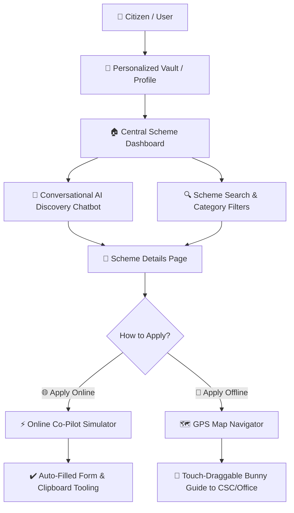

# 🏛️ YojnaSetu (योजनासेतु)
> **Bridging the Gap Between Indian Citizens and Government Schemes**

[](https://yojnasetu-ruby.vercel.app)
[](https://react.dev/)
[](https://vite.dev/)
[](https://leafletjs.com/)
[](https://opensource.org/licenses/MIT)

YojnaSetu is a premium, AI-powered digital assistance platform designed to simplify how citizens discover, verify eligibility for, and apply for government schemes in India. Built with a focus on accessibility and responsiveness, the platform guides users through verification checkpoints, documentation lists, and step-by-step application flows via interactive online and offline assistance co-pilots.

🌐 **Live Production Link**: [yojnasetu-ruby.vercel.app](https://yojnasetu-ruby.vercel.app)

---

## 🗺️ User Flow & System Architecture

This flow diagram illustrates how citizens interact with YojnaSetu to discover schemes and proceed with application assistance:



---

## 🌟 Premium Features

### 1. 🤖 Conversational AI Scheme Discovery
* **Guided Matching**: The chatbot conducts an interactive assessment, asking about age, income, caste, state, and occupation.
* **Auto Profile Sync**: Connects directly to the user's secure vault. Once the user updates their profile, search preferences sync instantly.

### 2. ⚡ Online Co-Pilot Simulator
* **Interactive Browser Emulation**: Simulates a live Chrome browser window and extension toolbar.
* **Smart Auto-Fill**: Automatically inputs mock candidate data to show users exactly how to fill out registration forms.
* **Ellipsis Address Bar**: Clean, truncated mock URL display to ensure compatibility on smaller smartphone screens.
* **Clipboard Assistant**: Displays user attributes as copyable cards for manual copy-paste simulation.

### 3. 🗺️ Interactive Offline Map Navigator
* **Bunny Route Guide**: A cute, animated bunny companion that walks the user step-by-step along the route to the nearest office (CSCs, Block Offices, etc.).
* **Draggable Touch Control**: Features full touch-listener implementations that limit boundaries dynamically, allowing free bunny dragging across mobile screens.
* **Accordion Detail Views**: GPS route settings, document checklists, and turn-by-turn navigation guides collapse into smooth accordion tabs on mobile viewports to conserve screen real estate.
* **Optimized Viewport Scale**: Calibrated default map zoom (`14`) displaying local area contexts immediately.

### 4. 🔀 Resilient Client-Side Hash Router
* **URL Synced Navigation**: Utilizes a lightweight, custom `hashchange` routing architecture.
* **Refresh Persistence**: Page reloads preserve parameters (e.g. `#/details?id=ira-wrflsncs`), restoring the exact state, active views, and query variables.

---

## 📊 Comparative Analysis: Online vs. Offline Co-Pilot

| Feature | ⚡ Online Co-Pilot | 🗺️ Offline Navigator |
| :--- | :--- | :--- |
| **Primary Goal** | Simulate digital application forms. | Guide users to physical administrative centers. |
| **Interactive Helper** | Browser Extension Simulator with clipboard tools. | Draggable Bunny mascot routing on Leaflet Map. |
| **Key Assets** | Document copy cards, auto-fill buttons. | Turn-by-turn directions, collapsible checklist. |
| **Mobile Adaptability** | Compact grid layout, auto-ellipsis URLs. | `35vh` Map canvas + `65vh` responsive sidebar. |

---

## 🛠️ Technology Stack

* **Core**: React 19.2 (Functional Components, Custom Hooks)
* **Build System**: Vite 8.0 (Fast HMR, asset minification)
* **Mapping**: Leaflet 1.9.4 & React Leaflet 5.0.0 (Custom geographic routes, circle markers)
* **Icons**: Lucide React (Crisp SVG vector iconography)
* **Styling**: Vanilla CSS (Fluid design tokens, variables, responsive breakpoints)

---

## 🚀 Installation & Setup

Get YojnaSetu running locally on your device in minutes:

### 1. Prerequisites
Ensure you have **Node.js** (v18+) and **npm** installed.

### 2. Setup the Repository
```bash
# Clone the repository
git clone https://github.com/priyanshi04-alt/yojnasetu.git

# Go into the project directory
cd yojnasetu

# Install dependencies
npm install
```

### 3. Run Development Server
```bash
npm run dev
```
Once started, navigate to **[http://localhost:5173](http://localhost:5173)** in your browser.

### 4. Compile Production Build
```bash
npm run build
```
Static assets will build into the `/dist` folder, optimized and ready to deploy.

---

## 📱 Mobile Responsiveness Overrides
* **Breakpoints**: Tailored specifically for viewports down to `320px` width.
* **Overflow Controls**: Hardcoded styles replaced by flexible classes (`details-container`, `copilot-grid-3`).
* **Input Optimization**: Inputs, select dropdowns, and button padding scale down on mobile to prevent clipping and layout breaking.
* **Accessibility**: Full compliance with `color-scheme: light` color contracts and keyboard navigation targets.
