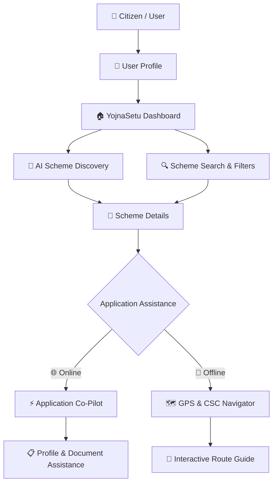

# 🏛️ YojnaSetu (योजनासेतु)

> **Bridging the Gap Between Indian Citizens and Government Schemes**

<p align="center">
  
</p>

YojnaSetu is an AI-powered digital assistance platform designed to simplify how citizens discover, understand eligibility for, and prepare to apply for government schemes in India.

The platform brings scheme discovery, personalized recommendations, document guidance, application assistance, and nearby support-center navigation into one user-friendly experience.

### 🌐 Live Demo

[YojnaSetu — Live Application](https://yojnasetu-ruby.vercel.app?utm_source=chatgpt.com)

---

## 🎯 Problem

Government schemes can be difficult to discover and understand because information is distributed across different sources, eligibility requirements can be complex, and application procedures may be unfamiliar to citizens.

YojnaSetu aims to simplify this journey by helping users:

* 🔍 Discover relevant government schemes
* ✅ Understand eligibility requirements
* 🤖 Ask questions using an AI assistant
* 📄 Prepare required documents
* ⚡ Understand online application procedures
* 📍 Find nearby support centres and offices

---

## 🗺️ User Flow & System Architecture



### Complete Journey

**Profile → Discover → Match → Understand → Prepare → Apply**

---

# 🌟 Key Features

## 1. 🔐 Personalized User Profile

Users can provide basic information used to personalize scheme discovery and recommendations.

The profile can include:

* Age
* State
* Occupation
* Caste category
* Annual income
* Other eligibility-related information

### Create Account

<p align="center">
  
</p>

---

## 2. 🤖 AI-Powered Scheme Discovery

YojnaSetu provides a conversational interface where users can describe what they need in natural language.

Users can explore areas such as:

* 🌾 Farmer schemes
* 🎓 Education scholarships
* 💼 Small business support
* 🏛️ Welfare schemes
* 📚 Other government benefits

The goal is to make scheme discovery easier without requiring users to understand complicated terminology.

### AI Chatbot

<p align="center">
  
</p>

---

## 3. 🔍 Personalized Scheme Recommendations

Users can search for schemes using profile-based criteria such as:

* Profession
* Caste
* State
* Age
* Income

The platform then presents schemes relevant to the provided information.

### Recommendation Results

<p align="center">
  
</p>

---

## 4. 📄 Detailed Scheme Information

Each scheme has a dedicated details page to help users understand what the scheme offers and how the application process works.

Information can include:

* Eligibility
* Benefits
* Application procedure
* Required documents
* Important instructions
* Online application assistance
* Offline assistance

### Scheme Details

<p align="center">
  
</p>

---

# ⚡ Online Application Co-Pilot

YojnaSetu includes an interactive **Application Co-Pilot** that demonstrates and guides users through the online application process.

### Key capabilities

* 🌐 Redirect to the relevant official application portal
* 📋 Convenient profile information copying
* 📝 Form-filling guidance
* 📂 Required document checklist
* 📄 Document upload guidance
* 🔗 Application reference tracking
* 💡 Step-by-step assistance

The Co-Pilot is designed as an **assistance layer** rather than claiming to submit applications on behalf of users.

### Application Co-Pilot

<p align="center">
  
</p>

---

# 🗺️ Interactive GPS & CSC Navigator

For users who require physical assistance, YojnaSetu provides an interactive map experience for locating relevant support centres and offices.

### Features

* 📍 Nearby office / CSC discovery
* 🗺️ Interactive map interface
* 🚗 Car navigation
* 🚶 Walking mode
* 🚌 Bus mode
* 🚆 Train mode
* 🐰 Interactive route companion
* 🧭 Turn-by-turn guidance
* 📱 Responsive map interface

### GPS & Bunny Navigator

<p align="center">
  
</p>

---

# 📑 Document Assistance

YojnaSetu helps users understand which documents may be required during the application process.

The interface can present requirements such as:

* Identity documents
* Income-related documents
* Ration card
* Employment-related documents
* Bank passbook
* Other scheme-specific documents

A document-vault workflow is also provided to organize required application documents.

---

# 🧠 AI-Assisted Guidance

AI assistance is integrated into the user journey to make government scheme information easier to understand.

### Assistance includes:

* 💬 Natural-language scheme discovery
* 📖 Simplified scheme explanations
* 👶 "Explain Like I'm 10" assistance
* 🇮🇳 Hindi explanations
* ❓ Eligibility guidance
* 📄 Document guidance
* 📝 Application guidance

---

# 🔄 Online vs Offline Assistance

| Feature            | ⚡ Online Co-Pilot                        | 🗺️ GPS & CSC Navigator               |
| ------------------ | ---------------------------------------- | ------------------------------------- |
| Primary Goal       | Guide users through digital applications | Help users locate physical assistance |
| Interface          | Application assistance interface         | Interactive map                       |
| Profile Assistance | ✅                                        | —                                     |
| Document Guidance  | ✅                                        | ✅                                     |
| Navigation         | Official portal redirection              | Route guidance                        |
| Interactive Helper | Application Co-Pilot                     | 🐰 Route Companion                    |
| Mobile Support     | ✅                                        | ✅                                     |

---

# 🛠️ Technology Stack

### Frontend

* **React 19.2**
* **Vite 8.0**
* Functional Components
* Custom Hooks

### Mapping

* **Leaflet 1.9.4**
* **React Leaflet 5.0.0**
* Interactive maps
* Geographic markers and routes

### UI & Styling

* Vanilla CSS
* CSS Variables
* Responsive layouts
* Responsive breakpoints

### Icons

* **Lucide React**

### Deployment

* **Vercel**

---

# 📱 Responsive Design

YojnaSetu is designed to provide a consistent experience across desktop and mobile devices.

Responsive considerations include:

* 📱 Mobile-friendly layouts
* 🔄 Flexible component layouts
* 📐 Responsive spacing
* 📝 Mobile-friendly forms
* 🗺️ Optimized map layouts
* 🔘 Touch-friendly controls
* 📂 Responsive information sections

---

# 🔀 Client-Side Navigation

YojnaSetu uses lightweight client-side navigation to provide a smooth single-page application experience.

This allows users to move between:

* Home
* Authentication
* Scheme Search
* Scheme Details
* Application Co-Pilot
* GPS Navigator
* AI Chat
* Documents Vault

without requiring traditional full-page navigation.

---

# 🚀 Installation & Setup

## Prerequisites

Make sure you have:

* Node.js 18+
* npm
* Git

## 1. Clone the Repository

```bash
git clone https://github.com/priyanshi04-alt/Yojna-Setu.git
```

## 2. Navigate to the Project

```bash
cd Yojna-Setu
```

## 3. Install Dependencies

```bash
npm install
```

## 4. Start the Development Server

```bash
npm run dev
```

Open the local URL provided by Vite, usually:

```text
http://localhost:5173
```

## 5. Build for Production

```bash
npm run build
```

The optimized production build will be generated in:

```text
dist/
```

---

# 📂 Repository Structure

```text
Yojna-Setu/
│
├── hss/
├── public/
├── src/
│
├── screenshots/
│   ├── home.png
│   ├── signup.png
│   ├── chatbot.png
│   ├── results.png
│   ├── scheme-details.png
│   ├── copilot.png
│   └── map.png
│
├── .gitignore
├── LICENSE
├── README.md
├── convert_csv.py
├── eslint.config.js
├── index.html
├── package-lock.json
├── package.json
└── vite.config.js
```

---

# 🎯 Design Principles

### 1. Simplicity

Government scheme information should be easier to understand without requiring users to interpret complex terminology.

### 2. Personalization

Scheme discovery should consider the user's profile and eligibility-related information.

### 3. Accessibility

The platform supports both digital application guidance and physical-location assistance for users who may need offline support.

### 4. Guided Experience

Instead of simply listing schemes, YojnaSetu guides users from discovery to understanding and application preparation.

---

# 🌍 Social Impact

YojnaSetu aims to reduce the information gap between government welfare programs and eligible citizens.

The platform focuses on:

* Improving scheme discoverability
* Simplifying eligibility information
* Helping users prepare documents
* Making application procedures easier to understand
* Supporting users who need offline assistance

---

# 🔮 Future Enhancements

Potential future improvements include:

* 🔐 Stronger authentication and identity verification
* 🧠 More advanced eligibility matching
* 📚 Expansion of the verified scheme database
* 🌐 Multi-language support
* 🔄 More frequent scheme information updates
* 📍 Improved live-location services
* 📊 Application status dashboard
* 🔔 Deadline and application notifications
* 📱 Progressive Web App support
* ♿ Enhanced accessibility features

---

# 📊 Project Highlights

| Area               | Implementation                           |
| ------------------ | ---------------------------------------- |
| Scheme Discovery   | Personalized search & AI assistant       |
| Eligibility        | Profile-based matching                   |
| AI Assistance      | Conversational & simplified explanations |
| Online Assistance  | Application Co-Pilot                     |
| Offline Assistance | GPS & CSC Navigator                      |
| Documents          | Document guidance & vault                |
| Maps               | Leaflet & React Leaflet                  |
| UI                 | Responsive React interface               |
| Navigation         | Client-side application navigation       |
| Deployment         | Vercel                                   |

---

# 👩‍💻 Author

**Priyanshi Soni**

B.E. Computer Science Engineering
Chitkara University, Himachal Pradesh

---

<p align="center">
  <strong>YojnaSetu — Making Government Schemes Easier to Discover, Understand & Apply.</strong>
</p>
