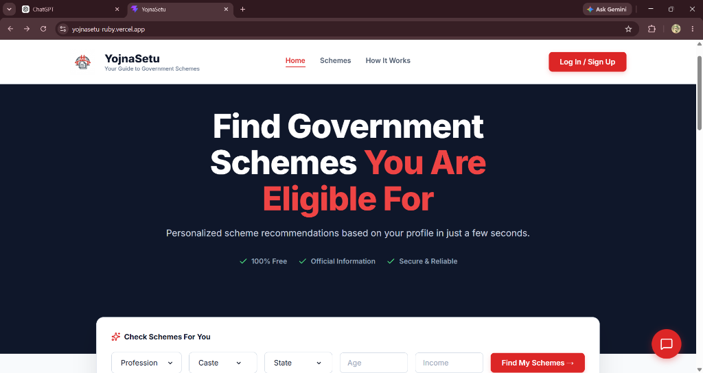
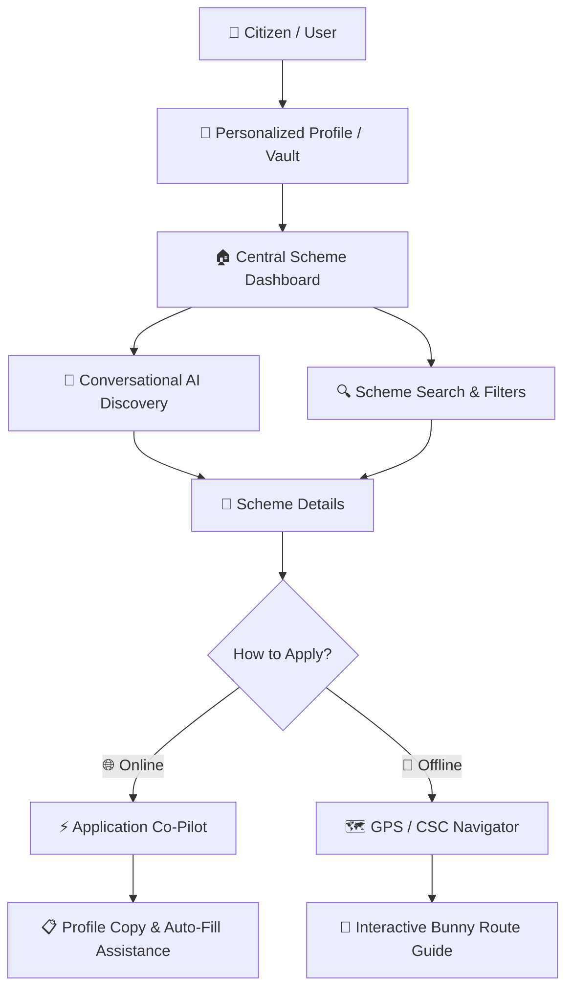
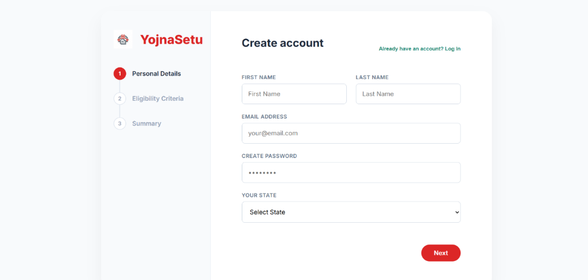
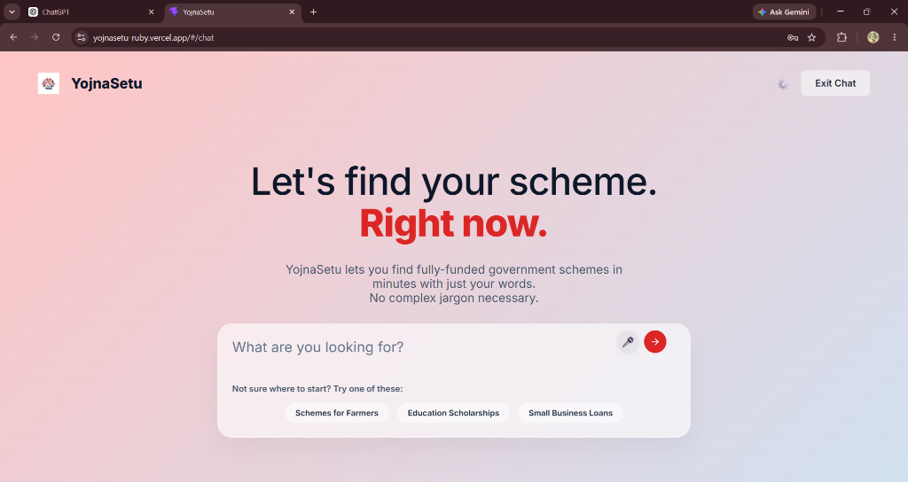
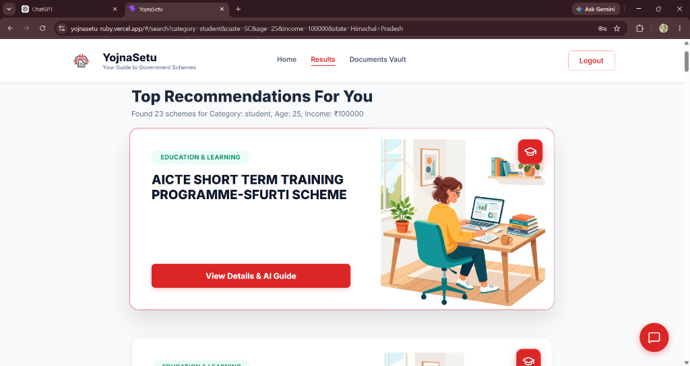
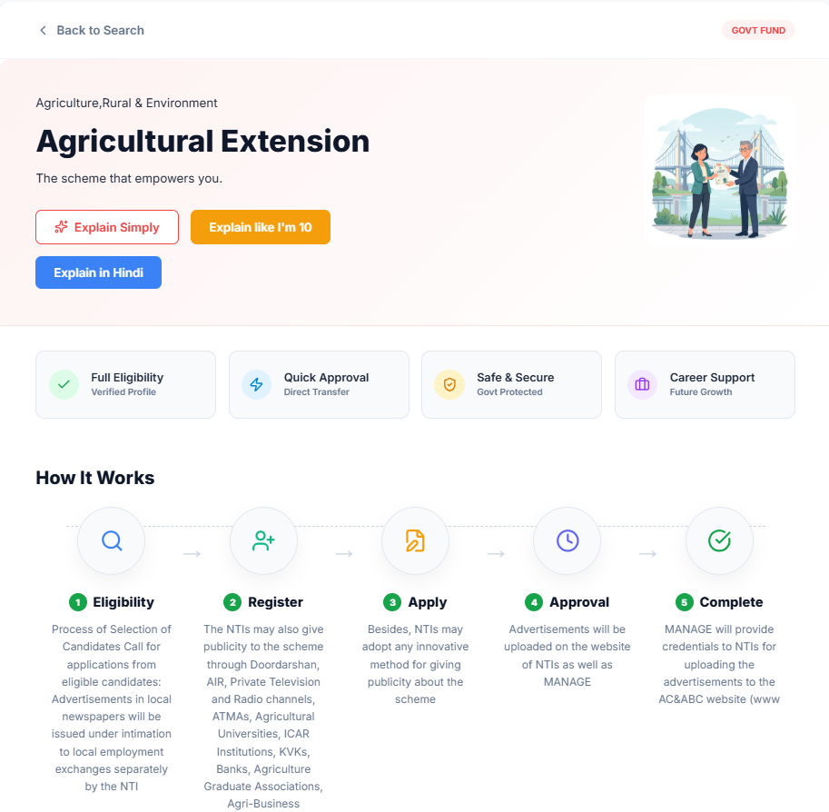
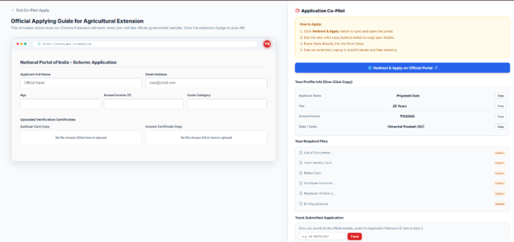
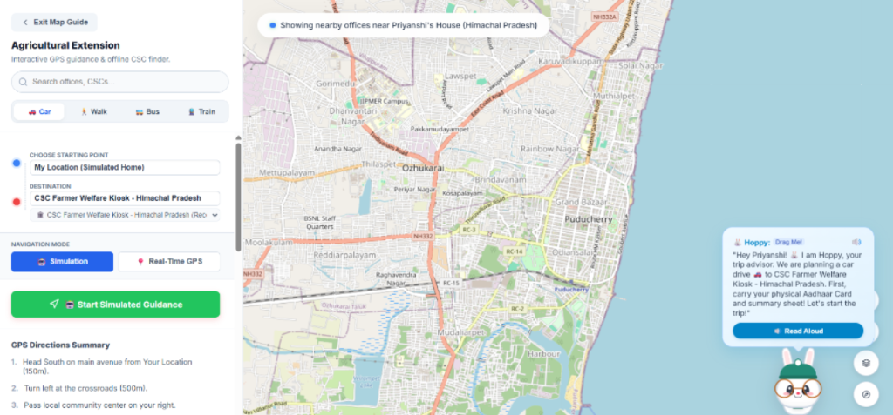

# 🏛️ YojnaSetu (योजनासेतु)

> **Bridging the Gap Between Indian Citizens and Government Schemes**

<p align="center">
  
</p>

YojnaSetu is a premium, AI-powered digital assistance platform designed to simplify how citizens discover, verify eligibility for, and apply for government schemes in India.

The platform helps users find relevant government schemes based on their profile, understand eligibility requirements, prepare required documents, and receive guided assistance for both online and offline applications.

🌐 **Live Production:** [yojnasetu-ruby.vercel.app](https://yojnasetu-ruby.vercel.app)

---

## ✨ Why YojnaSetu?

Finding the right government scheme can be difficult because information is often spread across multiple portals, eligibility rules can be complicated, and application procedures may be unfamiliar to citizens.

YojnaSetu brings these steps together into one guided platform:

* 🔍 Personalized government scheme discovery
* 🤖 AI-powered conversational assistance
* ✅ Eligibility-based recommendations
* 📄 Scheme details and document guidance
* ⚡ Online application Co-Pilot
* 🗺️ Offline office and CSC navigation
* 🔐 Personalized user profile and document vault
* 📱 Responsive and accessible interface

---

## 🗺️ User Flow & System Architecture



### Complete User Journey

**Profile → Discover → Match → Understand → Prepare → Apply Online / Offline**

---

# 🌟 Core Features

## 1. 🔐 Personalized Profile & Eligibility

Users create a profile containing important eligibility attributes such as:

* Age
* State
* Occupation
* Caste category
* Annual income
* Other relevant profile information

The profile is then used to personalize scheme recommendations.

### Create Account

<p align="center">
  
</p>

---

## 2. 🤖 Conversational AI Scheme Discovery

YojnaSetu provides a conversational interface where users can describe what they are looking for using natural language.

Users can explore areas such as:

* Farmer schemes
* Education scholarships
* Small business support
* Welfare schemes
* Other government benefits

The conversational experience reduces the need to understand complex government terminology.

### AI Scheme Discovery

<p align="center">
  
</p>

---

## 3. 🔍 Personalized Scheme Recommendations

The platform matches user information against available scheme criteria and presents relevant recommendations.

Users can search using:

* Profession
* Caste
* State
* Age
* Income

The result page presents schemes that match the provided profile.

### Scheme Recommendations

<p align="center">
  
</p>

---

## 4. 📄 Detailed Scheme Information

Each scheme has a dedicated details page that helps users understand the scheme before applying.

The page provides information such as:

* Eligibility
* Benefits
* Application process
* Required documents
* Important instructions
* Online application assistance
* Offline assistance

Users can also request simplified explanations through the AI assistance features.

### Scheme Details

<p align="center">
  
</p>

---

# ⚡ Online Application Co-Pilot

YojnaSetu provides an interactive **Application Co-Pilot** that guides users through the online application process.

Instead of simply redirecting users to an external portal, the Co-Pilot demonstrates how the application process works.

### Key Capabilities

* 🌐 Official portal redirection
* 📋 One-click profile information copying
* 📝 Form-filling guidance
* 📂 Required document checklist
* 📄 Document upload assistance
* 🔗 Application reference tracking
* 💡 Step-by-step application guidance

### Application Co-Pilot

<p align="center">
  
</p>

---

# 🗺️ Offline GPS & CSC Navigator

Not every citizen can complete an application online.

YojnaSetu therefore provides an offline assistance workflow that helps users locate nearby:

* Common Service Centres (CSCs)
* Government offices
* Support centres
* Other relevant administrative locations

The navigator uses an interactive map with route guidance and a visual companion to make the experience easier to understand.

### Offline Navigation Features

* 📍 Location-based office discovery
* 🗺️ Interactive Leaflet map
* 🚗 Car navigation
* 🚶 Walking mode
* 🚌 Bus mode
* 🚆 Train mode
* 🐰 Interactive draggable bunny guide
* 🧭 Turn-by-turn directions
* 📱 Mobile-friendly navigation interface

### GPS / Bunny Map

<p align="center">
  
</p>

---

# 📑 Document Assistance

YojnaSetu helps users understand and prepare documents required for applications.

The platform can display document requirements such as:

* Identity documents
* Income-related documents
* Ration card
* Employment-related documents
* Bank passbook
* Other scheme-specific documents

Users can maintain their documents through the platform's **Documents Vault** workflow.

---

# 🧠 AI-Assisted Guidance

YojnaSetu integrates AI assistance into multiple parts of the user journey.

### AI capabilities include:

* 💬 Natural-language scheme discovery
* 📖 Simplified scheme explanations
* 👶 "Explain Like I'm 10" mode
* 🇮🇳 Hindi explanations
* ❓ Eligibility guidance
* 📄 Document guidance
* 📝 Application assistance

The goal is to make government information easier to understand for users with different levels of technical knowledge.

---

# 🔀 Online vs Offline Co-Pilot

| Feature        | ⚡ Online Co-Pilot                | 🗺️ Offline Navigator                  |
| -------------- | -------------------------------- | -------------------------------------- |
| Primary Goal   | Assist with digital applications | Help reach physical assistance centres |
| Interface      | Browser/application simulator    | Interactive map                        |
| Assistance     | Profile copy & form guidance     | GPS & route guidance                   |
| Documents      | Digital document checklist       | Offline preparation guidance           |
| Navigation     | Official portal redirection      | CSC / office directions                |
| Companion      | Application Co-Pilot             | 🐰 Bunny Guide                         |
| Mobile Support | ✅                                | ✅                                      |

---

# 🛠️ Technology Stack

### Frontend

* **React 19.2**
* **Vite 8.0**
* Functional Components
* Custom Hooks
* Client-side routing

### Mapping

* **Leaflet 1.9.4**
* **React Leaflet 5.0.0**
* Interactive geographic routes
* Map markers
* Route visualization

### UI & Styling

* Vanilla CSS
* CSS Variables
* Responsive layouts
* Fluid design system
* Responsive breakpoints

### Icons

* **Lucide React**
* SVG-based iconography

### Deployment

* **Vercel**

---

# 📱 Responsive Design

YojnaSetu is designed to work across desktop and mobile screen sizes.

### Responsive improvements include:

* 📱 Mobile-friendly layouts
* 🔄 Flexible component grids
* 📐 Responsive spacing
* 🧭 Mobile navigation
* 📂 Collapsible information sections
* 🗺️ Optimized map viewport
* 📝 Mobile-friendly forms
* 🔘 Touch-friendly controls

The interface is optimized for smaller screens while maintaining the same core functionality.

---

# 🔀 Client-Side Hash Routing

YojnaSetu uses a lightweight hash-based navigation architecture.

Example:

```text
#/auth
#/search
#/details?id=ae
#/copilot?id=ae
#/offline_guide?id=ae
#/chat
```

This provides:

* URL-synchronized navigation
* Refresh persistence
* Query parameter support
* Direct page access
* Lightweight client-side routing

---

# 🚀 Installation & Setup

## 1. Prerequisites

Make sure the following are installed:

* Node.js 18+
* npm
* Git

## 2. Clone the Repository

```bash
git clone https://github.com/priyanshi04-alt/yojnasetu.git
```

## 3. Navigate to the Project

```bash
cd yojnasetu
```

## 4. Install Dependencies

```bash
npm install
```

## 5. Start Development Server

```bash
npm run dev
```

Open the local development URL shown by Vite, usually:

```text
http://localhost:5173
```

## 6. Build for Production

```bash
npm run build
```

The optimized production files will be generated inside:

```text
dist/
```

---

# 📂 Project Structure

```text
yojnasetu/
│
├── public/
│
├── screenshots/
│   ├── home.png
│   ├── signup.png
│   ├── chatbot.png
│   ├── results.png
│   ├── scheme-details.png
│   ├── copilot.png
│   └── map.png
│
├── src/
│   ├── components/
│   ├── pages/
│   ├── assets/
│   └── ...
│
├── package.json
├── vite.config.js
└── README.md
```

---

# 🎯 Design Philosophy

YojnaSetu is built around three principles:

### 1. Simplicity

Government schemes should be understandable without requiring users to interpret complex terminology.

### 2. Personalization

Recommendations should depend on the user's actual profile and eligibility criteria.

### 3. Accessibility

Users who are comfortable with technology should be able to apply online, while users who need physical assistance should receive offline navigation support.

---

# 🌍 Social Impact

YojnaSetu aims to reduce the gap between **government benefits and the citizens who are eligible for them**.

The platform focuses on:

* Improving scheme discoverability
* Reducing information barriers
* Simplifying eligibility understanding
* Helping users prepare documents
* Guiding citizens through application workflows
* Supporting users who need offline assistance

---

# 🔮 Future Enhancements

Potential future improvements include:

* 🔐 Stronger authentication and identity verification
* 🧠 More advanced AI-based eligibility matching
* 📚 Larger verified government scheme database
* 🌐 Multi-language support
* 🔄 Real-time scheme information updates
* 📍 More accurate live location services
* 📊 Application status dashboard
* 🔔 Application and deadline notifications
* 📱 Progressive Web App support
* ♿ Enhanced accessibility features

---

# 🏆 Project Highlights

| Area               | Implementation                           |
| ------------------ | ---------------------------------------- |
| Scheme Discovery   | Personalized search & AI chatbot         |
| Eligibility        | Profile-based matching                   |
| AI Assistance      | Conversational & simplified explanations |
| Online Assistance  | Application Co-Pilot                     |
| Offline Assistance | GPS / CSC Navigator                      |
| Documents          | Document checklist & vault               |
| Maps               | Leaflet + React Leaflet                  |
| Routing            | Custom hash-based routing                |
| UI                 | Responsive React interface               |
| Deployment         | Vercel                                   |

---

# 👩‍💻 Author

**Priyanshi Soni**

B.E. Computer Science Engineering
Chitkara University, Himachal Pradesh

---

## ⭐ Support the Project

If you find YojnaSetu useful or interesting, consider giving the repository a ⭐ on GitHub.

<p align="center">
  <strong>YojnaSetu — Making Government Schemes Easier to Discover, Understand & Apply.</strong>
</p>
